# Dukes of realms
## Description du jeu

Dans ce mini jeu vidéo, l'objectif est de conquérir les châteaux ennemis. Les modes d'interactions sont les suivants :

- Clic droit de la souris sur un château pour faire apparaitre un menu contextuel
- Clavier lors de la demande de saisie d'information (pseudo, nombre de troupe)

Le jeu se déroule dans un royaume lointain, à la stabilité discutable, dans lequel le trône a été laissé vacant suite à diverses intrigues qu’il ne nous appartient pas de décrire ici. Chaque joueur incarne un duc, en lutte pour devenir le nouveau roi. Pour cela, ils doivent vassaliser les autres en conquérant leur terres.

Les joueurs disposent de châteaux générant des richesses avec lesquels ils pourront lever des osts (troupes) pour attaquer les châteaux adverses. Le jeu se termine dès qu’un seul duc possède encore au moins un château.

 

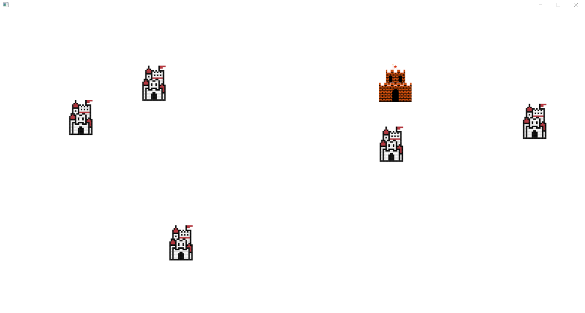

## Mode d'emploi
### Lancement

Au lancement vous devez saisir un entier qui déterminera votre nom durant le jeu qui fait office de pseudo.
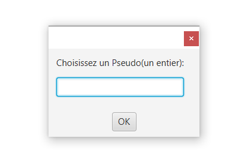

### Régles du jeu

Un fois votre pseudo saisie le jeu commence. Vous pourrez apercevoir plusieur château identique qui sont des château de barons dont vous pouvais vous emparer pour gagner. Pour ce faire il vous faudra des troupes (vous disposez d'une troupe au commencement), pour former ces troupes il vous faut avoir assez de trésorie (ici le florin qui est la monnaie du jeu).

Votre château a vous est le château différent des autres qui se distingue facilement par sa couleur :

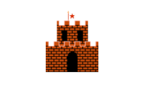

Vous pouvez intéragir avec le jeu en faisant un clique droit de la souris sur les châteaux, lors de ce clique un menu contextuel s'ouvrira en fonction de si le château est allié ou ennemi.

Si le chateau est allié vous aurez les options suivantes : 

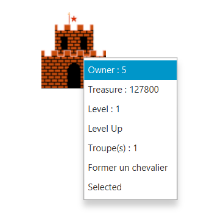

- Owner: Permet de savoir à qui appartient le château
- Treasure: Permet de savoir quelle est la trésorie actuelle du château
- Level: Permet de savoir quel est le niveau du château, celui-ci influence vos gains par secondes (au niveau  vous gagnez 50 florins/s, ensuite (50 + 30 * level)/s)
- Level up: Permet d'augmenter le niveau du château
- Troupe(s): Permet de savoir le nombre de troupe(s) présente(nt) dans le château
- Former troupe(s): Permet de former des troupes pour ensuite attaquer
- Select(ed): Permet de sélectionner le château qui attaquera, passe à Selected quand le château est sélectionné

Si le château n'est pas allié vous aurez les options suivantes :

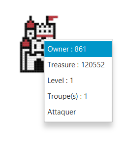

Ce menu à des options similaires au menu allié, Owner, Treasure, Level, Troupe(s) y sont présents le changement est le fait de pouvoir attaquer le château.

- Attaquer: Permet d'attaquer le château depuis le château actuellement sélectionné.

Le but du jeu est donc, à l'aide de ses différents menus, de conquérir l'ensemble du plateau de jeu.

#### Former une troupes 

Pour former une troupe il faut donc que le château soit un château vous appartenant, et que votre trésorie soit à la hauteur de votre demande. Vous aurez donc la possibilité de cliquer sur "Former troupe(s)" : 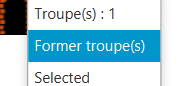

Une fenêtre PopUp s'ouvrira sur laquelle vous pourrez saisir un entier. 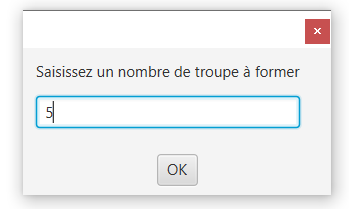

Cliquez ensuite sur le bouton OK pour valider votre saisie. Les troupes seront maintenant en cours de formation.

Si vous saisissez autre chose que des chiffres un message d'erreur s'affichera. 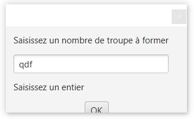

#### Attaquer un château

Pour attaquer un château il faut que celui-ci ne soit pas un allié. Vous aurez donc la possibilité de cliquer sur "Attaquer" : 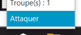

De la même façon que vous avez formé des troupes, une fénêtre s'ouvre où vous pouvez saisir un chiffre qui correspond au nombre de troupe que vous désirez envoyer. 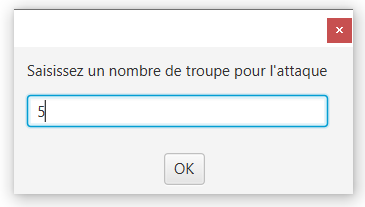

Cliquez ensuite sur OK pour valider votre saisie. Vous pourrez ensuite apercevoir vos troupes se diriger vers votre cible.

#### Prise de château

Pour prendre pocession d'un château, il vous faut l'attaquer avec vos troupes. Le prise se fait automatiquement lorsque le château ciblé n'a plus de troupes pour le défendre. L'attaque se déroule comme suit :

- La première troupes attaquante va attaquer la première troupes du château défenseur
- Pour tuer une troupes en défense il faut faire baisser ses points des vie à zéro.
- Pour faire baisser les points de vie d'une troupe, l'attaque de la troupe attaquante est pris en compte; ainsi le défenseur prendra autant de dégat que l'attaquant à de dégat. Une fois ses dégats infligé l'attaquant est détruit.

Ici on a qu'un seul type de troupe qui ont toutes les même caractéristique. Chaque troupes a 50 points de vie et 20 points de dégats, il faudra donc 3 troupes attaquantes pour venir à bout d'une troupes défensives.

#### Avoir plus de ressources

Pour vous enrichir la seul solution est d'attendre, votre trésorie augmente automatiquement au fil du temps. Bien évidemment il est possible de gagner plus d'argent, pour cela il vous faut augmenter le niveau de votre château ce qui augmentera vos revenus. De plus lorsque vous vous saisissez d'un château l'ensemble de sa trésorie reste à votre disposition.

Pour augmenter le niveau de votre château cliquez sur Level Up : 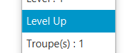

Un message s'affichera sur la ligne de commande vous permettant de savoir combien de temps prendra l'amélioration.

## Fonctionnalité

Liste des fonctionnalités de notre jeu

### Formation d'une troupe

Il est possible de former une troupe en cliquant sur le bouton correspondant du menu. Lors d'un clique une fenêtre s'ouvre vous dmeandant un nombre de troupes à former. Une fois valider le programme va créer autant d'objet Troops que vous le désirez, et va les ajouter à la liste de troupes de l'objet Castle appelant.

### Attaque d'un château

L'attaque de château se fait également suite au clique sur le menu. Une fenêtre s'ouvre vous demandant un nombre de troupes participantes à l'attaque. Une fois validé, le programme créée une nouvelle liste de troupes, il va pour ce faire ajouter une troupes présentes dans les troupes du château et supprimer celle-ci de la liste.
Une fois la nouvelle liste compléter l'attaque débute et vous pouvez apercevoir les troupes ce déplacer.

### Prise de château

Pour prendre pocession d'un château, il vous faut l'attaquer avec vos troupes. Le prise se fait automatiquement lorsque le château ciblé n'a plus de troupes pour le défendre. L'attaque se déroule comme suit :

- La première troupes attaquante va attaquer la première troupes du château défenseur
- Pour tuer une troupes en défense il faut faire baisser ses points des vie à zéro.
- Pour faire baisser les points de vie d'une troupe, l'attaque de la troupe attaquante est pris en compte; ainsi le défenseur prendra autant de dégat que l'attaquant à de dégat. Une fois ses dégats infligé l'attaquant est détruit.

Ici on a qu'un seul type de troupe qui ont toutes les même caractéristique. Chaque troupes a 50 points de vie et 20 points de dégats, il faudra donc 3 troupes attaquantes pour venir à bout d'une troupes défensives.

Pour ce faire à chaques troupes attaquantes on enlève un nombre de points de vie à la troupe défensive. une fois ses points de vie à zéro la troupe est supprimée.

### Augmentation du niveau du château

Le joueur a la possibilité d'augmenter le niveau de son château, pour se faire il clique sur "Level Up". Ce qui aura pour effet d'enclacher l'augmentation du niveau du château. Le château vera ainsi ses revenus augmenter de 30 pour chaque niveau. Au niveau 1 un château gnagne 50 florins/s, au niveau 2 80/s, niveau 3 110/s, etc.

