# Dukes of realms
## Description du jeu

Dans ce mini jeu vidéo, l'objectif est de conquérir les châteaux ennemis. Les modes d'interactions sont les suivants :

- Clic droit de la souris sur un château pour faire apparaitre un menu contextuel
- Clavier lors de la demande de saisie d'information (pseudo, nombre de troupe)

Le jeu se déroule dans un royaume lointain, à la stabilité discutable, dans lequel le trône a été laissé vacant suite à diverses intrigues qu’il ne nous appartient pas de décrire ici. Chaque joueur incarne un duc, en lutte pour devenir le nouveau roi. Pour cela, ils doivent vassaliser les autres en conquérant leurs terres.

Les joueurs disposent de châteaux générant des richesses avec lesquels ils pourront lever des osts (troupes) pour attaquer les châteaux adverses. Le jeu se termine dès qu’un seul duc possède encore au moins un château.

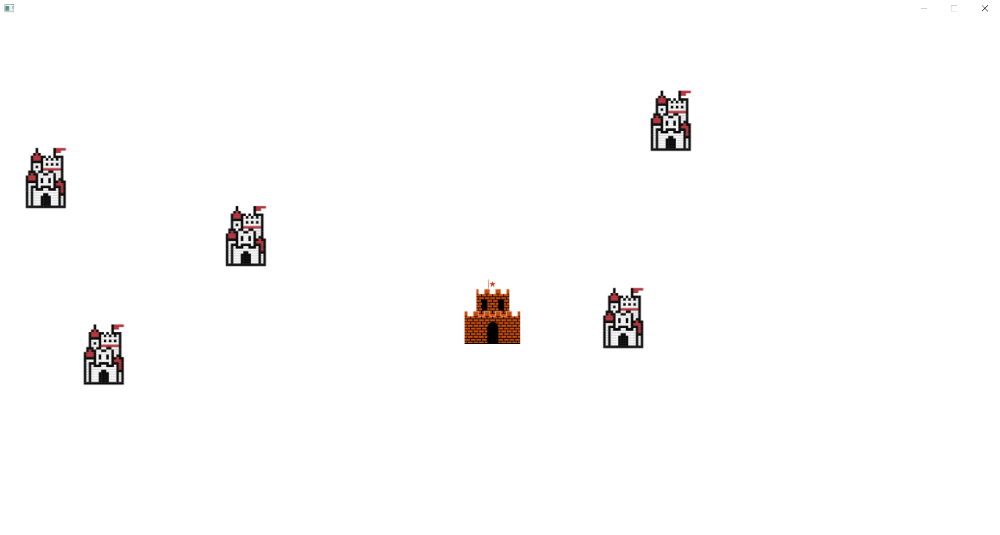

## Mode d'emploi
### Lancement

Au lancement vous devez saisir un entier qui déterminera votre nom durant le jeu qui fait office de pseudo. 
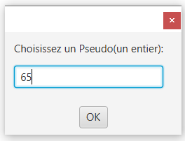

### Règles du jeu

Un fois votre pseudo saisie le jeu commence. Vous pourrez apercevoir plusieurs châteaux identiques qui sont des châteaux de barons dont vous pouvais vous emparer pour gagner. Pour ce faire il vous faudra des troupes (vous disposez d'une troupe au commencement), pour former ces troupes il vous faut avoir assez de trésorerie (ici le florin qui est la monnaie du jeu).

Votre château est le château différent des autres qui se distingue facilement par sa couleur :

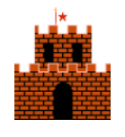

Plusieurs messages qui explicitent ce qui se passe sur le plateau sont affichés sur la ligne de commande pour rendre le jeu plus ludique et compréhensible.

Vous pouvez interagir avec le jeu en faisant un clic droit de la souris sur les châteaux, lors de ce clique un menu contextuel s'ouvrira en fonction de si le château est allié ou ennemi.

#### Si le château est allié vous aurez les options suivantes : 

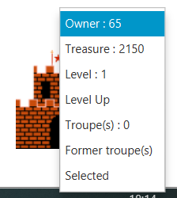

- Owner : Permet de savoir à qui appartient le château
- Treasure : Permet de savoir quelle est la trésorerie actuelle du château
- Level : Permet de savoir quel est le niveau du château, celui-ci influence vos gains par secondes (au niveau vous gagnez 50 florins/s, ensuite (50 + 30 * level)/s)
- Level up : Permet d'augmenter le niveau du château
- Troupe(s) : Permet de savoir le nombre de troupe(s) présente(nt) dans le château
- Former troupe(s) : Permet de former des troupes pour ensuite attaquer
- Select(ed) : Permet de sélectionner le château qui attaquera, passe à Selected quand le château est sélectionné

Si le château est allié et n'est pas sélectionner il vous est possible de lui envoyer des troupes de renfort en cliquant sur "Recevoir troupe(s)"
- Recevoir troupe(s) : Permet de recevoir des troupes depuis le château sélectionné
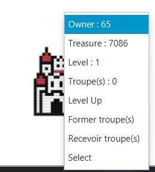

#### Si le château n'est pas allié vous aurez les options suivantes :

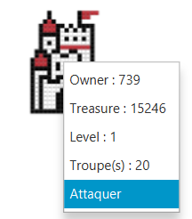

Ce menu à des options similaires au menu allié, Owner, Treasure, Level, Troupe(s) y sont présents le changement est le fait de pouvoir attaquer le château.

- Attaquer : Permet d'attaquer le château depuis le château actuellement sélectionné.

Le but du jeu est donc, à l'aide de ses différents menus, de conquérir l'ensemble du plateau de jeu ci-dessous vous pourrez retrouver une explication du fonctionnement de chaque fonctionnalité du menu :

##### Former une troupe
 
Pour former une troupe il faut donc que le château soit un château vous appartenant, et que votre trésorerie soit à la hauteur de votre demande. Vous aurez donc la possibilité de cliquer sur "Former troupe(s)" :  

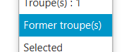

Une fenêtre Pop-up s'ouvrira sur laquelle vous pourrez saisir un entier.  

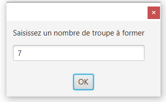

Cliquez ensuite sur le bouton OK pour valider votre saisie. Les troupes seront maintenant en cours de formation.

Si vous saisissez autre chose que des chiffres un message d'erreur s'affichera. 

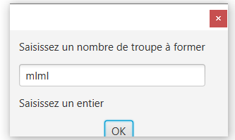

##### Attaquer un château

Pour attaquer un château il faut que celui-ci ne soit pas un allié. Vous aurez donc la possibilité de cliquer sur "Attaquer" : 

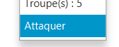

De la même façon que vous avez formé des troupes, une fenêtre s'ouvre où vous pouvez saisir un chiffre qui correspond au nombre de troupe que vous désirez envoyer. 

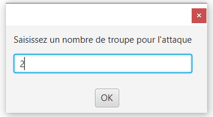

Cliquez ensuite sur OK pour valider votre saisie. Vous pourrez ensuite apercevoir vos troupes se diriger vers votre cible.

Un message s'affiche sur la ligne de commande indiquant le château attaquant, le nombre de troupes envoyées, le château attaqué.

##### Prendre un château

Pour prendre possession d'un château, il vous faut l'attaquer avec vos troupes. La prise se fait automatiquement lorsque le château ciblé n'a plus de troupes pour le défendre. L'attaque se déroule comme suit :

- La première troupe attaquante va attaquer la première troupe du château défenseur
- Pour tuer une troupe en défense il faut faire baisser ses points des vies à zéro.
- Pour faire baisser les points de vie d'une troupe, l'attaque de la troupe attaquante est prise en compte ; ainsi le défenseur prendra autant de dégât que l'attaquant à de dégât. Une fois ses dégâts infligé l'attaquant est détruit.

Ici on a qu'un seul type de troupe qui ont toutes les mêmes caractéristiques. Chaque troupe à 50 points de vie et 20 points de dégâts, il faudra donc 3 troupes attaquantes pour venir à bout d'une troupes défensives.

Un message s'affiche sur la ligne de commande indiquant l'attaque de la troupe attaquante, et les points de vie de la troupe défensive.

##### Envoyer des renforts

Pour envoyer des renforts il vous faudra cliquer sur le bouton "Recevoir troupe(s)" du château receveur. 

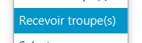

Une fenêtre pop-up s'ouvrira sur laquelle vous pourrez, comme pour l'attaque et la formation, saisir un chiffre correspondant au nombre de troupe(s) à envoyer en renfort au château.

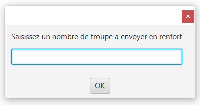

Un message s'affiche sur la ligne de commande indiquant le château donneur et le nombre de troupes données.

##### Avoir plus de ressources

Pour vous enrichir la seule solution est d'attendre, votre trésorerie augmente automatiquement au fil du temps. Bien évidemment il est possible de gagner plus d'argent, pour cela il vous faut augmenter le niveau de votre château ce qui augmentera vos revenus. De plus lorsque vous vous saisissez d'un château l'ensemble de sa trésorerie reste à votre disposition.

Pour augmenter le niveau de votre château cliquez sur Level Up : 

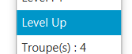

Un message s'affiche sur la ligne de commande vous permettant de savoir combien de temps prendra l'amélioration.

## Fonctionnalité

Liste des fonctionnalités de notre jeu

### Formation d'une troupe

Le joueur a la possibilité de former une troupe en cliquant sur le bouton correspondant du menu. Lors d'un clique une fenêtre s'ouvre vous demandant un nombre de troupes à former. Une fois valider le programme va créer autant d'objet Troops que vous le désirez, et va les ajouter à la liste de troupes de l'objet Castle appelant.

### Attaque d'un château

Le joueur a la possibilité d'attaquer un château en cliquant sur le menu. Une fenêtre s'ouvre vous demandant un nombre de troupes participantes à l'attaque. Une fois validé, le programme créée une nouvelle liste de troupes, il va pour ce faire ajouter une troupe présente dans les troupes du château et supprimer celle-ci de la liste. Une fois la nouvelle liste compléter l'attaque débute et vous pouvez apercevoir les troupes se déplacer.

### Prise de château

Le joueur a la possibilité de prendre possession d'un château, faut l'attaquer avec vos troupes. La prise se fait automatiquement lorsque le château ciblé n'a plus de troupes pour le défendre. L'attaque se déroule comme suit :

- La première troupe attaquante va attaquer la première troupe du château défenseur
- Pour tuer une troupe en défense il faut faire baisser ses points des vies à zéro.
- Pour faire baisser les points de vie d'une troupe, l'attaque de la troupe attaquante est prise en compte ; ainsi le défenseur prendra autant de dégât que l'attaquant à de dégât. Une fois ses dégâts infligé l'attaquant est détruit.

Ici on a qu'un seul type de troupe qui ont toutes les mêmes caractéristiques. Chaque troupe à 50 points de vie et 20 points de dégâts, il faudra donc 3 troupes attaquantes pour venir à bout d'une troupes défensives.

Pour ce faire à chaque troupe attaquante on enlève un nombre de points de vie à la troupe défensive. Une fois ses points de vie à zéro la troupe est supprimée.

### Augmentation du niveau du château

Le joueur a la possibilité d'augmenter le niveau de son château, pour se faire il clique sur "Level Up". 
Ce qui aura pour effet d'enclencher l'augmentation du niveau du château. 

Le château verra ainsi ses revenus augmenter de 30 pour chaque niveau. Au niveau 1 un château gagne 50 florins/s, au niveau 2 80/s, niveau 3 110/s, etc.

### Envoie de renfort

Le joueur a la possibilité d'envoyer des troupes en renfort dans un autre de ses châteaux. Pour ce faire il doit d'abord s'il veut changer le château émetteur cliquer sur "Select" du château choisis ; ensuite il n'a plus qu'à choisir le château qui va recevoir les troupes en cliquant sur "Recevoir troupe(s)", ce qui aura pour effet d'ouvrir une fenêtre pop-up sur laquelle il saisira un nombre de troupe(s) à envoyer. 
Une fois le bouton OK pressé, les troupes disponibles dans le château émetteur se supprime une fois arriver à destination et de nouvelles troupes sont créer dans le château receveur.

### Amélioration à apportées

- Système de Sauvegarde de partie.
- Différents types de troupes.
- Un menu de démarrage.
- Un décor plus enrichi.
- Plus de liberté dans le choix du pseudo.
- Un bandeau informatif qui affiche les stats du château sélectionné.
