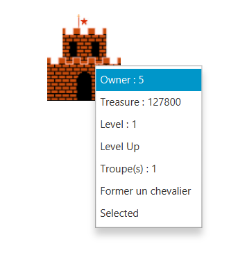
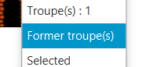
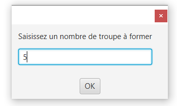
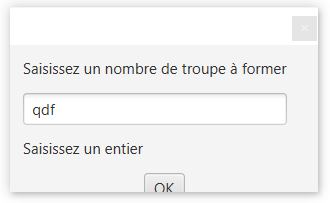
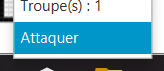

# Dukes of realms
## Description du jeu

Dans ce mini jeu vidéo, l'objectif est de conquérir les châteaux ennemis. Les modes d'interactions sont les suivants :

- Clic droit de la souris sur un château pour faire apparaitre un menu contextuel
- Clavier lors de la demande de saisie d'information (pseudo, nombre de troupe)

Le jeu se déroule dans un royaume lointain, à la stabilité discutable, dans lequel le trône a été laissé vacant suite à diverses intrigues qu’il ne nous appartient pas de décrire ici. Chaque joueur incarne un duc, en lutte pour devenir le nouveau roi. Pour cela, ils doivent vassaliser les autres en conquérant leur terres.

Les joueurs disposent de châteaux générant des richesses avec lesquels ils pourront lever des osts (troupes) pour attaquer les châteaux adverses. Le jeu se termine dès qu’un seul duc possède encore au moins un château.

 


## Mode d'emploi
### Lancement

Au lancement vous devez saisir un entier qui déterminera votre nom durant le jeu qui fait office de pseudo.


### Régles du jeu

Un fois votre pseudo saisie le jeu commence. Vous pourrez apercevoir plusieur château identique qui sont des château de barons dont vous pouvais vous emparer pour gagner. Pour ce faire il vous faudra des troupes (vous disposez d'une troupe au commencement), pour former ces troupes il vous faut avoir assez de trésorie (ici le florin qui est la monnaie du jeu).

Votre château a vous est le château différent des autres qui se distingue facilement par sa couleur :


Vous pouvez intéragir avec le jeu en faisant un clique droit de la souris sur les châteaux, lors de ce clique un menu contextuel s'ouvrira en fonction de si le château est allié ou ennemi.

Si le chateau est allié vous aurez les options suivantes : 



- Owner: Permet de savoir à qui appartient le château
- Treasure: Permet de savoir quelle est la trésorie actuelle du château
- Level: Permet de savoir quel est le niveau du château, celui-ci influence vos gains par secondes (au niveau  vous gagnez 50 florins/s, ensuite (50 + 30 * level)/s)
- Level up: Permet d'augmenter le niveau du château
- Troupe(s): Permet de savoir le nombre de troupe(s) présente(nt) dans le château
- Former troupe(s): Permet de former des troupes pour ensuite attaquer
- Select(ed): Permet de sélectionner le château qui attaquera, passe à Selected quand le château est sélectionné

Si le château n'est pas allié vous aurez les options suivantes :


Ce menu à des options similaires au menu allié, Owner, Treasure, Level, Troupe(s) y sont présents le changement est le fait de pouvoir attaquer le château.

-Attaquer: Permet d'attaquer le château depuis le château actuellement sélectionné.

Le but du jeu est donc, à l'aide de ses différents menus, de conquérir l'ensemble du plateau de jeu.

#### Former une troupes 

Pour former une troupe il faut donc que le château soit un château vous appartenant. Vous aurez donc la possibilité de cliquer sur "Former troupe(s)" : 

Une fenêtre PopUp s'ouvrira sur laquelle vous pourrez saisir un entier. 
Cliquez ensuite sur le bouton OK pour valider votre saisie. Les troupes seront maintenant en cours de formation.

Si vous saisissez autre chose que des chiffres un message d'erreur s'affichera. 

#### Attaquer un château

Pour attaquer un château il faut que celui-ci ne soit pas un allié. Vous aurez donc la possibilité de cliquer sur "Attaquer" : 


## Pause active

Modifier le comportement du jeu pour créer une pause active lors d'un appui sur une touche spécifique. Dans cet état, le temps est figé mais il est toujours possible d'interagir avec le jeu (accès au menu contextuel du joueur par exemple).

La gestion du temps se fait dans la class `Main.java` avec le code suivant:

```java
gameLoop = new AnimationTimer() {
  @Override
  public void handle(long now) {
      // boucle du jeu 
  }
}
gameLoop.start();
```


