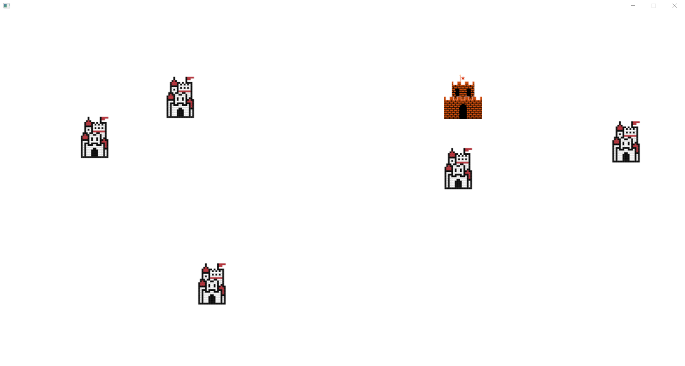

# Dukes of realms
## Description du jeu
### Test

Dans ce mini jeu vidéo, l'objectif est de conquérir les châteaux ennemis. Les modes d'interactions sont les suivants :

- Clic droit de la souris sur un château pour faire apparaitre un menu contextuel
- Clavier lors de la demande de saisie d'information (pseudo, nombre de troupe)

Le jeu se déroule dans un royaume lointain, à la stabilité discutable, dans lequel le trône a été laissé vacant suite à diverses intrigues qu’il ne nous appartient pas de décrire ici. Chaque joueur incarne un duc, en lutte pour devenir le nouveau roi. Pour cela, ils doivent vassaliser les autres en conquérant leur terres.

Les joueurs disposent de châteaux générant des richesses avec lesquels ils pourront lever des osts (troupes) pour attaquer les châteaux adverses. Le jeu se termine dès qu’un seul duc possède encore au moins un château.

 




# À faire 

Pour mieux comprendre le fonctionnement du jeu, nous vous demandons d'apporter les modifications suivantes.


## Super ennemi

Faites en sorte que chaque ennemi ait un nombre de vies allant de 1 pour le plus petit à 5 pour le plus gros. Modifiez le programme pour titrer aléatoirement un type d'ennemi et ajuster à la fois sa taille et son nombbre de vies. Il faut regarder la classe `Enemy.java` ainsi que la méthode `spawnEnemies` de la classe `Main.java`.

## Pause active

Modifier le comportement du jeu pour créer une pause active lors d'un appui sur une touche spécifique. Dans cet état, le temps est figé mais il est toujours possible d'interagir avec le jeu (accès au menu contextuel du joueur par exemple).

La gestion du temps se fait dans la class `Main.java` avec le code suivant:

```java
gameLoop = new AnimationTimer() {
  @Override
  public void handle(long now) {
      // boucle du jeu 
  }
}
gameLoop.start();
```


